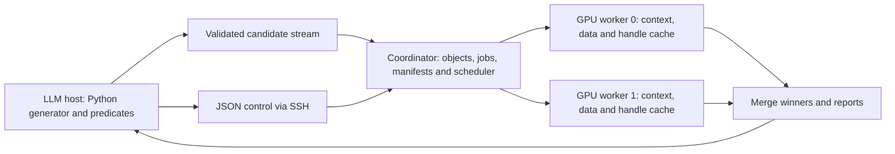

<!--
SPDX-FileCopyrightText: 2026 Charles Durham
SPDX-License-Identifier: MIT

MIT License

Copyright (c) 2026 Charles Durham

Permission is hereby granted, free of charge, to any person obtaining a copy
of this software and associated documentation files (the "Software"), to deal
in the Software without restriction, including without limitation the rights
to use, copy, modify, merge, publish, distribute, sublicense, and/or sell
copies of the Software, and to permit persons to whom the Software is
furnished to do so, subject to the following conditions:

The above copyright notice and this permission notice shall be included in all
copies or substantial portions of the Software.

THE SOFTWARE IS PROVIDED "AS IS", WITHOUT WARRANTY OF ANY KIND, EXPRESS OR
IMPLIED, INCLUDING BUT NOT LIMITED TO THE WARRANTIES OF MERCHANTABILITY,
FITNESS FOR A PARTICULAR PURPOSE AND NONINFRINGEMENT. IN NO EVENT SHALL THE
AUTHORS OR COPYRIGHT HOLDERS BE LIABLE FOR ANY CLAIM, DAMAGES OR OTHER
LIABILITY, WHETHER IN AN ACTION OF CONTRACT, TORT OR OTHERWISE, ARISING FROM,
OUT OF OR IN CONNECTION WITH THE SOFTWARE OR THE USE OR OTHER DEALINGS IN THE
SOFTWARE.
-->

**Odezza scoring service and LLM-directed trajectory search — proposed plan**

Prepared September 4, 2026. This document proposes an API and implementation sequence; the service, Python helpers, and request fields shown below are not implemented yet. It draws on the current C99 scoring engine, the scratch family-search tooling, and the repository/machine audit. Creating this plan does not change Rack1 or start a server.

September 5 update: the [unified search design](unified_search_design.md) is the
current authoring and planning direction. It combines templates and bounded grammar
generation with shared choices, parameter identities, native predicate data and
an explicit execution plan. Arbitrary Python predicates remain a declared trusted
client/extension path; the service boundary is validated data. The operational and
numerical requirements below remain relevant; overlapping authoring/API examples
are earlier proposals rather than a second contract to implement.

The [restricted grammar runner](../scratch/grammar_search/RUNNER.md) now provides
a first end-to-end command with explicit parameter rows, C99 batch scoring,
global/per-family winners and replay. It keeps the context/handle alive within a
request. A resident request service and GPU RNG remain unimplemented.

**Purpose and success condition**

An LLM receives an ODE system, one or more unknown right-hand sides, observations, and explicit constraints. It proposes expression families, submits large batches of complete candidate systems for trajectory scoring, receives compact comparative reports, and uses those reports to choose the next search or refinement request.

The intended advantage is low wall-clock time to a useful, independently validated equation under sparse/noisy observations and expressive nested structures. Configuration throughput is an enabling measurement. The application measurement is time to held-out trajectory accuracy and, where identifiable, structural recovery.

The history gives a coherent reason for this design: PTX specialization of increasingly fused kernels and dynamic device-function linking incurred compilation/linking costs that limited their usefulness for rapidly changing populations. Preserve those abandoned paths as documented decisions and useful controls. The next interface should make native specialization accessible without making the LLM write another C99 application for each problem.

Primary decisions proposed here:

- Use a small Python library over Odezza's expression objects for generation, traversal, filtering and tagging.
- Use versioned JSON for control and reports, with compact streamed binary data for large candidate/data payloads.
- Preserve complete multi-RHS systems as the scoring unit from the first service version.
- Run one persistent GPU worker process per GPU, coordinated by a lightweight server.
- Begin with the existing scoring kernel and explicit constant banks; add deterministic GPU Philox generation, then measure whether fusion improves the complete request.
- Define exact ranking and replay contracts before finalizing LM topology.

**1. Current reusable pieces and gaps**

| Existing piece | Reuse | Work needed |
|---|---|---|
| [Public scoring API](/Users/cdurham/code/odezza/src/odezza.h) | Complete complementary RHS sets, reusable handle/workspace, resident caller data | Service lifecycle, repeated requests and per-device ownership |
| [C99 pipeline](/Users/cdurham/code/odezza/src/o_scoring_pipeline.c) | Specialization, eager load/launch/unload and bounded execution resources | Reduction integration and, if measurements justify it, prepared resident candidate batches |
| [Family generator](/Users/cdurham/code/odezza/scratch/family_search/family_search.py) | Expression parsing, deterministic expansion, provenance and binary encoding ideas | Reusable Python interface, arbitrary predicates, streaming and complete multi-RHS candidate records |
| [Family-screen executable](/Users/cdurham/code/odezza/scratch/family_search/o_family_screen.c) | Dataset adaptation, public scoring calls, basic winner records | It assumes one unknown RHS, chooses device 0, allocates broad score arrays, and bundles experiment-specific refinement |
| Existing tests and incidents | AST validation, toggle semantics, CPU replay, physical-inspection regressions | Protocol, chunking, reduction, retry, RNG and multi-GPU tests |
| Earlier Philox code and benchmarks | Algorithm experience and comparison fixtures | A new scheduling-independent counter contract; do not copy the old launch/thread-index assumptions |

The current family-bank header has a single `unknown_state` and requires `known_count + 1 == state_count`. The core `OdezzaScoringSystem` already supplies several RHS programs. Generalize the bank/service representation rather than carrying the scratch format's restriction into the public service.

The current family CLI's minimum-three-bank constraint and rejection of zero constant capacity also belong to its experimental workflow. Pure-toggle and literal-only requests should use one logical bank, with zero active constants when supported by the core shape. Verify that path explicitly.

**2. Expression generation: Python as the authoring interface**

The [grammar design review](grammar_design_review.md) records limitations of the later motif-grammar proposal and specifies the distinction between early pruning, complete-tree predicates, accepted-population quotas, and filtered toggle execution. Its APIs remain proposed.

Separate three activities: proposing expressions, validating what was proposed, and executing validated systems. Arbitrary structural rules belong naturally in Python. A small expression API should provide:

- Immutable state, parameter, literal, unary/binary/FMA and toggle nodes.
- Tree traversal, subtree matching, operator counts, depth, parameter/state usage and function-nesting queries.
- Deterministic bounded enumeration and explicitly named sampling methods.
- Candidate-system construction, named filters, tags and streaming serialization.
- A preview containing examples, filter rejections, counts where knowable, and exact source/environment identities.

This is a library API rather than a new large textual language. The core mathematical expression representation remains Odezza's existing AST. Common grammar helpers can become declarative JSON forms once real usage shows which ones are stable; arbitrary rules remain Python predicates.

Illustrative proposed Python usage, not runnable against today's package:

```python
from odezza.search import (
    CandidateSystem, ExpressionSpace, Parameter, Uniform,
    states, sin, cos, stream_candidates,
)

x, y, z = states("x", "y", "z")
c0 = Parameter("c0", Uniform(-2.0, 2.0))
c1 = Parameter("c1", Uniform(-2.0, 2.0))
c2 = Parameter("c2", Uniform(-2.0, 2.0))

arguments = ExpressionSpace(
    leaves=[x, y, z, c0],
    operators=["add", "sub", "mul", "sin", "cos"],
    max_nodes=7,
    max_function_nesting=2,
)

def accept(rhs):
    return rhs.node_count <= 25 and rhs.uses_state("z")

def candidates():
    # Sampling mode and draw count are explicit; this is not exhaustive.
    for a, b in arguments.sample_pairs(seed=41, draws=100_000):
        rhs = sin(a) * cos(b) + c1*y - c2*z
        if not accept(rhs):
            continue
        yield CandidateSystem(
            rhs={"z": rhs},
            tags={
                "family": "trig_product",
                "nesting": rhs.function_nesting,
                "proposal_round": 1,
            },
        )

stream_candidates(candidates(), "candidate-bank.odzb")
```

Named-filter instrumentation should report how many candidates were rejected by `accept`, with bounded examples and overlapping-filter semantics specified. The example is deliberately one particular proposed family, not a claim of coverage of all nested equations. Multi-RHS records use, for example, `rhs={"y": rhs_y, "z": rhs_z}` and score that pair together. Shared parameters have one identity across the entire system. An explicit Cartesian product, paired list or joint generator must determine how several RHS spaces are combined; silently changing that combination changes the search.

Arbitrary Python cannot generally provide a cheap proof of the complete generated set or even guarantee termination. Use work/time/memory limits for generators and distinguish exact counts, bounds, estimates, emitted prefixes and sampled sets. Running a predicate on an example AST proves the predicate accepts it; it does not prove a generator can emit that AST. Coverage checks should make this distinction. A reference-AST reachability check is appropriate for synthetic fixtures and post-reveal diagnosis, not for supplying hidden answers during a blind search.

Deduplicate exact validated program structures with parameter aliasing and toggle coupling preserved. Keep all provenance/tag memberships for aliases. Do not silently reorder FP32 arithmetic to implement algebraic canonicalization. A candidate cap, deduplication rule or filter revision is part of the search definition and belongs in the report.

**Where Python runs**

Initially, run generators on the LLM's host or in a separate trusted CPU process, streaming validated data to Rack1. Persist the generator source, parameter document, package version, seed and emitted-bank hash. This supports arbitrary predicates while keeping a generator crash or endless loop separate from GPU workers.

If later requests carry Python source to Rack1, run it in a separately isolated execution environment with explicit input/output capabilities and resource limits. A subprocess alone separates failures but is not a security boundary. Removing builtins, restricting globals or applying a syntax blacklist does not make arbitrary Python safe; Python's own [execution documentation](https://docs.python.org/3/library/functions.html#exec) explicitly rejects the restricted-builtins assumption. The persistent coordinator/CUDA worker must not directly `exec` submitted snippets.

A future evaluated subset of Python syntax is another option, but it becomes a language that must be defined and maintained. It is unnecessary for the first trusted research workflow.

**3. Proposed service objects and request boundary**

Keep large observations, expression banks and score surfaces out of ordinary JSON messages. JSON names immutable registered objects and describes the work. Small inline datasets/candidate batches are useful for tests and interactive probes; large ones use a framed binary stream or uploaded file plus hash.

| Object | Contents |
|---|---|
| Dataset | State ordering, ragged offsets, times, observed state values, named splits, initial-state policy and units/noise metadata |
| Problem | Dataset reference, fixed RHS programs, complementary unknown RHS indices, parameter identity conventions |
| Candidate set | Complete candidate RHS tuples, stable IDs, parameter schemas, toggle identities, tags, generator/filter provenance |
| Sampling plan | Explicit banks or a fully specified RNG distribution/stream/sample range; optional exact incumbent banks |
| Objective | Split, uninterrupted rollout versus reset segments, MSE denominator, precision, integrator/substeps and invalid policy |
| Job | References above, work budget, requested reports, requested/allowed execution policy and idempotency key |
| Result | Winners, counts/statistics, completed work ranges, execution provenance and validity status |

Suggested operations: `capabilities`, `register_dataset`, `register_problem`, `append_candidates`, `seal_candidates`, `analyze`, `score`, `job_status`, `cancel`, `get_results`, `replay`, and later `refine`. A candidate stream may be scored in bounded chunks while arriving, but the result must record whether the stream was sealed and fully consumed. Initial implementation may require sealing before submission to simplify exact retries.

`analyze` returns a concrete execution plan: supported operators/shapes, proposed capacities, number of configurations, memory estimates, cache hits/misses, any known shape restrictions and the sampling objective. It should be available as a preview, without requiring a manual approval round trip for every ordinary scoring request. Unsupported semantics cause explicit errors; the service must not silently remove trajectories, lower AST depth, change precision or narrow a grammar.

Illustrative request for the Philox-enabled phase:

```json
{
  "schema": "odezza.score.request",
  "version": 1,
  "idempotency_key": "experiment-17-round-3-score",
  "problem_id": "problem-17",
  "candidate_set_id": "bank-round-3",
  "objective": {
    "kind": "trajectory_mse",
    "split": "train",
    "trajectory_mode": "uninterrupted",
    "aggregation": "observed_scalar_mean",
    "initial_state_policy": "first_observation_fixed",
    "integrator": "rk4",
    "precision": "f32",
    "steps_per_interval": 16,
    "nonfinite_policy": "invalid"
  },
  "parameters": {
    "source": "philox",
    "placement": "gpu_buffer",
    "algorithm": "philox4x32_10",
    "mapping_version": 1,
    "seed": "73019",
    "sample_begin": "0",
    "samples_per_system": 4096,
    "distributions": "candidate_parameter_schema"
  },
  "toggles": {"mode": "all_declared_permutations"},
  "budget": {"max_configurations": "1000000000"},
  "execution": {"devices": "all_healthy", "policy": "balanced"},
  "return": {
    "top_k_systems": 100,
    "configurations_per_system": 1,
    "top_k_per_group": {"tag": "family", "k": 20},
    "statistics_by": ["family", "nesting"],
    "include_replay_records": true,
    "include_raw_scores": false
  }
}
```

Large counters and seeds use decimal strings where they could exceed JSON clients' exact integer range. The billion-configuration ceiling is illustrative, not a throughput claim or an instruction to run a campaign. Version 1's initial implementation uses `source: explicit_banks`; advertise Philox only after its phase passes validation.

Count requested work as the sum over systems of `(bank count × declared toggle permutations)`, with any fixed incumbent banks accounted for explicitly. If the requested expansion exceeds the budget, reject or require a named sampling/range policy; do not silently score an order-dependent prefix. Chunking and GPU scheduling must preserve the declared work.

Parameter schemas can express uniform lower/upper bounds and normal mean/standard deviation. A clipped normal, truncated normal, log-uniform distribution or mixture is a separate declared policy, not a silent interpretation of bounds. Begin with independent uniform and normal parameters plus exact explicit banks; add correlated local proposals later if needed.

**4. Results should help the LLM choose its next request**

The default ranking unit is a distinct candidate system, represented by its best valid configuration. Return additional configurations per system on request. Otherwise a single structure with many nearby constant draws can consume the whole top-k.

Each retained winner should include:

- Complete RHS programs and readable expression text, fixed/unknown index mapping, system ID and all tags.
- Exact parameter FP32 bit patterns plus readable decimal values; materialized toggle choices and original permutation index.
- Raw MSE, separately identified selection penalties if any, configuration/sample IDs, objective and dataset identities.
- Replay input references and an explicit status distinguishing scored, independently replayed and finally validated.

Global and per-family top-k should coexist. Tags are caller-defined metadata, while physical batching is chosen from compatible execution shapes. A structure may belong to multiple groups; group counts may therefore overlap. Deduplication must preserve these memberships.

Useful reports contain:

| Report | Purpose |
|---|---|
| Generated/emitted/rejected/deduplicated/system counts | Expose what the generator actually supplied |
| Requested/completed/valid/invalid configuration counts | Expose coverage and interruption without confusing structures with starts |
| Per-family best-system scores and score quantiles | Compare useful families; label exact versus sampled quantiles |
| Per-family valid fraction and draw budget | Distinguish a promising family from one mostly producing divergent systems; expose unequal search effort |
| Improvement over retained incumbents | Guide continued sampling or family expansion |
| Complexity/accuracy alternatives | Preserve compact explanations alongside the raw MSE winner |
| Timing and cache report | Separate generation, queue, creation/compile, RNG, specialization/load, execution, reduction, transfer and total wall time |
| Numerical diagnostics for selected winners | Per-state/per-trajectory residuals, stricter integration and independent replay |

For distributions, distinguish configuration-level scores from each system's best score. A minimum over more draws tends to improve with the draw budget; it is not an exposure-independent estimate of family quality. Validation used by the LLM becomes part of adaptive development. Keep a separate final evaluation split for locked candidates and report any earlier access.

Initial correctness reference: score bounded chunks and aggregate on the CPU. The scalable path adds fixed GPU reduction kernels after the scoring kernel and transfers winners/summaries. This preserves the existing patched scorer while changing output handling. A billion FP32 scores is about 4 GB before metadata, so downloading or retaining the full surface should be opt-in.

For exact chunked/distributed ranking, reduce configuration scores into per-system winners, merge by stable system/configuration identity, and retain sufficient winners for every requested grouping. Define deterministic tie ordering, for example score then system ID then sample/permutation ID. Do not discard to global top-k before computing per-family top-k. Validate the optimized reduction against a full-score CPU reference with ties, overlapping tags, invalid values and repeated systems across chunks.

Count/minimum and appropriately merged moments can be streamed; label approximate quantiles and floating-reduction differences. Candidate-level nonfinite rollouts are distinct from compilation failures or GPU errors. Do not call overflow a proven physical blow-up unless it is actually diagnosed. No hidden clipping of trajectories or scores.

**5. Persistent Rack1 architecture and multi-GPU ownership**



A Python standard-library coordinator is a reasonable initial control layer. Persistent C99 worker processes own CUDA contexts and call the existing library through a small framed command/data protocol. A C extension is an alternative, but should not be required merely to keep contexts alive. Batch serialization and Python coordination costs must appear in end-to-end timing.

Use SSH to reach a local service socket on Rack1 initially. The daemon lifetime should be independent of an individual SSH client's connection. Store job states and completed chunk manifests so a disconnect does not lose work. Public HTTP exposure is a separate deployment choice, unnecessary for this experiment.

Each GPU worker owns its context, persistent dataset allocations, reusable device buffers, cached scoring handles and caller workspaces. The same worker thread makes the correct context current for create/run/destroy. Never share a pipeline handle, CUDA pointer, stream or mutable workspace between devices. Device UUIDs belong in reports; they do not determine random-number identity.

Initially shard whole candidate systems across GPUs. This preserves per-system parameter/toggle groups locally and makes merging simpler. Replicate immutable trajectory data on both devices. When a small number of systems supplies many parameter draws, add disjoint sample-range sharding with stable global IDs. Dynamic scheduling can then give more work to a faster available GPU without changing draws.

Cap each worker's outstanding memory and compiled-handle count. Use bounded batches and backpressure. Cancellation is checked between bounded submissions; the current synchronous scoring call cannot promise immediate interruption of an executing CUDA kernel. A watchdog can detect an overdue worker and contain the job, but stopping a host process is not a guarantee of immediate recovery from every GPU fault.

Track partial/completed/failed/cancelled jobs and merge each chunk at most once. A retry must use the same work IDs and sampling range. Adaptive decisions should occur at reproducible round barriers by default; reacting to whichever GPU finishes first can make the search depend on scheduling even when RNG is deterministic.

**Persistence has several levels**

| Retained item | Immediate benefit | Existing boundary |
|---|---|---|
| CUDA context and dataset | Avoid repeated setup/uploads | Owned by the new worker |
| Scoring handle/workspace | Avoid repeated template creation and resource creation | Existing public API supports reuse |
| Raw compiled template | Share compilation across compatible handles/devices | Requires an explicit internal cache; current `o_nvrtc_compilation.c` directly invokes NVRTC |
| Specialized module for the same candidate batch | Reuse across several sampling/refinement passes | Current `pipeline_run` unloads modules before returning; this requires a distinct internal execution capability |

Keeping the context alive does not by itself remove module load/unload. Start with handle reuse, then measure whether repeated submissions of the same survivors justify a prepared-batch lifetime. Do not expose module tickets to the LLM.

A raw-template cache key must include generated source/generator ABI, target architecture, capacities, compiler version/options and any feature ABI such as fused RNG. A handle cache also includes fixed RHS and active-count identities plus its owning context. A specialized resident-batch cache additionally includes candidate programs. Normal driver/NVRTC warm-cache behavior is not a replacement for explicit provenance.

Rack1's identical SM120 GPUs can potentially share immutable compiled bytes; each still needs its own context-bound resources. Use coordinated cache population so two workers do not launch the same expensive cold compile concurrently. This needs internal library work because the public handle currently performs compilation itself.

**6. Philox sampling contract and implementation sequence**

Philox is a good fit because samples can be addressed by counters, enabling repeatable partitioning without a mutable RNG state per GPU lane. NVIDIA exposes Philox with uniform/normal-family distribution transforms; its [cuRANDDx description](https://docs.nvidia.com/cuda/curanddx/api/description_ops.html) also notes that some floating distributions are not bit-identical across architectures. Treat the integer stream and its floating transform as separately versioned contracts.

The old [kindrfm Philox header](/Users/cdurham/code/capybara-club/kindrfm/src/headers/philox.h) explicitly assumes launch thread IDs and warns of a 32-bit state repeat. Its arithmetic can inform a new implementation; those state/launch assumptions do not meet this service's requirements. The system-ID hashed-incumbent generator is a separate hash/mixer, not Philox.

Define a logical sample by `(seed, sampling-stream ID, global bank/sample index, parameter component group)`. Exclude GPU index, launch number, CTA width and chunk position. For a fixed sealed manifest, scheduling on one or two GPUs, changing chunk sizes, and retrying work must request the same integer words.

One concrete proposed Philox4x32-10 encoding is:

```text
64-bit Philox key = experiment seed
128-bit counter  = [sample_low32, sample_high32,
                   parameter_word_group32, sampling_stream_id32]
```

Assign stream IDs uniquely within a seed namespace, persist their mapping, and reject overflow rather than wrapping. Candidate identities remain separate hashes; do not truncate a candidate hash and assume collision-free stream assignment. Reusing a stream across systems can implement intentionally shared draws only when the parameter schemas and request say so. Resampling changes the explicit range or seed; a retry changes neither. Define normal-pair consumption and uniform endpoints in the transform version.

Constants must be generated once per configuration before RK4, then remain fixed across all stages, intervals and trajectories. Every occurrence of a parameter index reads the same value. Under the current bank/toggle convention, all toggle permutations for a bank must share its constants; exclude the permutation from the RNG key. Fused generation may redundantly regenerate that bank in several lanes, which is a real tradeoff against prefilled buffers.

The planned modes are:

1. **Explicit materialized banks:** the reference and exact-replay path, with finite test fixtures and existing core behavior.
2. **GPU-generated bank buffer:** a fixed Philox fill kernel writes bounded parameter banks, then the existing scorer reads them. This removes host generation/upload of the large bank without changing the scoring scaffold. Buffer/range sizing must account for repeated module loading between chunks.
3. **Philox fused into scoring:** generate parameters in the kernel prologue and keep them in registers. Benchmark against mode 2 on identical logical samples and objective work. Adopt only in the regimes where end-to-end measurements justify it.

Uniform/normal plus scale/shift is a sensible first interface. The branch is uniform when all lanes executing it have the same distribution choice for that parameter slot. The current one-system-per-CTA mapping helps. If sampling mixtures vary by lane, uniformity is no longer guaranteed; partition compatible proposal types into launches or measure the divergent form. Uniform branching still costs instructions and can affect register allocation. Inspect the generated CUBIN rather than assuming it is free.

Avoid drawing inside the RHS evaluator and avoid repeated expensive state initialization in the inner loop. NVIDIA's [device API performance notes](https://docs.nvidia.com/cuda/curand/device-api-overview.html#performance-notes) discuss initialization overhead and resource use. Use an available, validated implementation or a reviewed stateless core; do not add a toolchain/package dependency merely to write this plan, and retain the ten-round algorithm unless a distinct measured change is explicitly chosen.

Return exact winning parameter bits. Integer Philox replay should be exact; normal transforms and subsequent FP32 trajectories need their own cross-architecture tolerance/replay contract. Never reconstruct a claimed identical winner solely from rounded decimal output or a different normal transform.

The purpose of additional samples is useful search coverage. Growing banks to fill a GPU can improve amortization while reducing the rate of distinct structures. Benchmark both new systems per second and configurations per second, plus improvements per fixed search budget. For refinement, include the unchanged incumbent explicitly and sample declared neighborhoods around it; unconstrained high-dimensional random draws are not a replacement for local optimization.

**7. Scientific objective and competitive evaluation**

Sparse observations and nested unknown laws are a plausible opportunity because Odezza can score complete trajectories directly. This remains a hypothesis about end-to-end discovery. Robust alternatives already exist: [Weak SINDy](https://arxiv.org/abs/2005.04339) replaces pointwise derivative approximations with weak-form measurements, and [PySR's custom-objective interface](https://ai.damtp.cam.ac.uk/pysr/v1.5.9/api) allows custom evaluation rather than requiring ordinary tabular MSE. These are comparison directions, not a claim that an off-the-shelf trajectory adapter already matches this service.

Separate three comparisons:

- **Engine:** identical candidate systems, constants, toggles and integration work through Odezza and an independently implemented evaluator. Report cold and warm request costs separately.
- **Search interface:** identical observation access, prior constraints, LLM/tool budget and fixed engine; compare generator/feedback policies, including fixed or random proposals, to measure the LLM's contribution.
- **Complete recovery:** credible derivative-based SR, a weak/integral approach, and trajectory-objective symbolic search/parameter fitting, each with documented adaptation and tuning budgets. Include any existing SRBench results as historical motivation, not a transfer guarantee to ODE recovery.

Start with a small controlled suite varying nesting, regular/irregular observation density, measurement noise, one/two unknown RHS, parameter dimension and trajectory count. Include a case whose true nested AST is admitted by the declared grammar, an intentionally excluded fixture that diagnoses coverage, and multiple valid surrogate solutions. Ground truth is held by the evaluator during blind runs. Generated systems and random seeds should extend beyond models used to tune the workflow.

For noisy observations, the initial condition is a real modeling choice. Today's scorer fixes it to the first observation. Declare that policy and test its sensitivity; do not present it as fitting latent noiseless initial states. An explicit initial-state buffer or nuisance-parameter optimization can be a later extension. Likewise, dense-state observations at sparse times are supported, while partial state observability is a different capability.

Use uninterrupted rollout MSE as the default scoring request. Reset-segment or short-horizon screens are separately named objectives with their own reports and later full-rollout promotion checks. Raw MSE should be defined as summed squared residuals divided by the counted post-initial observed scalar values. Equal-trajectory weighting, state normalization, robust losses and observation masks require explicit capability and semantics; do not silently substitute them. Current unweighted scoring can be the first supported objective.

A fixed RK4 step count gives different step sizes on irregular gaps. Check finalists at finer steps and with independent higher-accuracy replay. Numerical integration error must be small enough for the claimed comparison. Sparse/noisy trajectories can support several indistinguishable equations; report predictive success and structural recovery separately. Noise robustness does not remove identifiability limits.

Measure success probability and time to a predeclared held-out accuracy/complexity target over multiple problems/seeds. Include failed attempts, compile/generation overhead, CPU/GPU resources and LLM usage. A broad superiority claim should wait for that evidence; the initial target is a reproducible advantage in a stated ODE regime.

**8. Implementation phases and acceptance gates**

| Phase | Deliverable | Acceptance gate |
|---|---|---|
| 0 — Rack1 and source baseline | A named source snapshot and explicit environment record on Rack1 | Both RTX 5080s independently run core scoring/reference checks; record source/compiler/device IDs. Resolve existing local/Ada/Rohini drift before comparisons |
| 1 — One-GPU service | Dataset/problem/candidate registration, explicit banks, complete RHS tuples, repeated JSON scoring and CPU reference reports | Several requests reuse one worker context and handle; one/two unknown RHS fixtures match independent CPU replay; small full output and top-k agree; pure-toggle one-bank request performs no redundant bank work |
| 2 — Python authoring and two GPUs | Streaming generator API, arbitrary named filters/tags, bounded system sharding and exact report merge | One-GPU versus two-GPU materialized-bank runs preserve work IDs and winners; a filter/grammar fixture exposes an excluded expression; generation/cancellation/retry and overlapping groups pass |
| 3 — Scalable sampling and output | Philox GPU buffers, bounded score chunks, GPU winner reductions and continuation by sample range | CPU/GPU integer RNG known-answer tests; range/boundary/chunk/device independence; exact top-k versus full-score oracle; winner constants replay; report complete-request throughput and memory |
| 4 — Amortization experiments | Matched fused-RNG comparison, explicit raw-template cache, optional prepared candidate-batch reuse | Adopt only measured improvements without changing samples/objective/coverage; record compile, registers, stack, shared memory, loading and numerical agreement |
| 5 — Discovery study | A small blind sparse/noisy/nested ODE suite and comparative reports | Fixed protocol and budgets, untouched final evaluation, multiple seeds, explicit failure/identifiability outcomes, cold/warm and one/two-GPU measurements |
| 6 — LM promotion | A `refine` request taking retained system/configuration IDs and explicit starts | Same objective/replay records; measured layout choice by target/workload; pre/post-refinement validation and exact constants; no dependency on the unresolved long-iteration 32-thread path |

Phase 2 can implement generation and multi-GPU wiring independently in development, but both require the phase-1 reference contract. Phase 3 need not wait for an ideal LM shape. Do not expand the test campaign while an affected correctness or provenance defect remains unclassified.

The first useful vertical slice is deliberately small: one Python generator emitting tagged complete systems, one JSON scoring request, two persistent Rack1 workers, explicit constant banks, exact global/per-family winners, and independent replay. It should demonstrate the user workflow before kernel optimization adds more choices.

**Rack1 setup facts and boundaries**

The audit observed two RTX 5080s with compute capability 12.0, driver 595.71.05, Ubuntu 26.04.1, and a CUDA 13.1 directory under `/usr/local`. GCC, Make and Python were available; `nvcc`, Git and CMake were absent from the default SSH PATH, and `~/code` did not exist. Recheck paths and library/header availability when implementation starts. These are observations, not a completed toolchain qualification.

The repository already has a [Makefile](/Users/cdurham/code/odezza/Makefile) using `CUDA_PATH=/usr/local/cuda`; normal project builds are the supported first route. Full `make test` includes a CMake-based style check, so running only Make-compatible subsets must be labeled as partial validation. If required tooling is truly missing, follow the user's supported installation/administrator boundary. No downloading/building missing tooling from source or privilege workaround is part of this plan.

**9. Decisions to retain and revisit deliberately**

- Keep JSON at the service boundary and Python for flexible generation; revisit server-executed generators only when client generation/transfer is a measured limitation.
- Keep candidate-system identity separate from tags, GPU assignment and parameter draws.
- Keep a fully materialized reference path for replay even if Philox fusion becomes faster.
- Keep the present scoring topology as the first baseline. Choose capacities from actual ASTs and measured supported shapes; report overallocations such as the SM120 one-system workaround explicitly.
- Keep LM optional in the workflow until scoring requests, ranking, provenance and replay are stable.
- Treat any change to grammar, sampling, objective, dataset split, numerical policy or execution mode as a recorded experimental decision.

The next implementation should make an LLM's request inspectable: which complete systems it proposed, which work the service performed, what won within each family, and what exact follow-up would improve the result.
